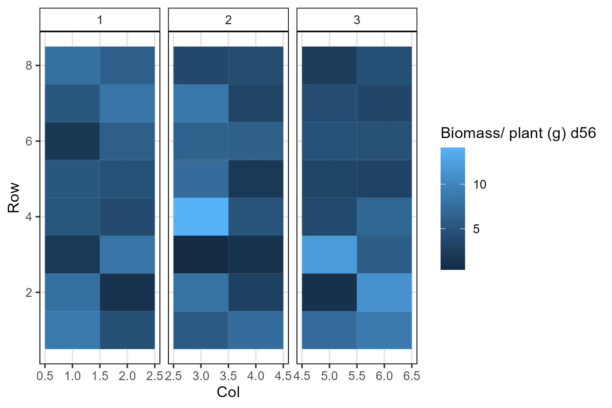

```{r setup, include=FALSE}
knitr::opts_chunk$set(eval = F, echo = T, message = F, warning = F, 
                      comment = NA, out.width = "100%")
```

---

# Introduction

This vignette contains the `R` code and analysis done for the paper: 

`r shiny::icon("newspaper")` [Derek Wright, Sandesh Neupane & Kirstin E Bett (2020) **PhenoLentil UAV**](https://github.com/derekmichaelwright/PhenoLentil_UAV) 

`r shiny::icon("github")` https://github.com/derekmichaelwright/PhenoLentil_UAV

---

This work done as part of the AGILE  and P2IRC projects at the University of Saskatchewan.


---

# Load Libraries

```{r}
library(tidyverse)
library(ggbeeswarm)
library(ggpubr)
library(readxl)
library(plotly)       # ggplotly()
library(htmlwidgets)  # saveWidget()
library(FactoMineR)   # PCA()
#library(ggrepel)      # geom_text_repel()
theme_AGL <- theme_bw() + 
  theme(strip.background   = element_rect(colour = "black", fill = NA, size = 0.5),
        panel.background   = element_rect(colour = "black", fill = NA, size = 0.5),
        panel.border       = element_rect(colour = "black", size = 0.5),
        panel.grid         = element_line(color  = alpha("black", 0.1), size = 0.5),
        panel.grid.minor.x = element_blank(), 
        panel.grid.minor.y = element_blank())
```

```{r eval = T, echo = F}
downloadthis::download_link(
  link = "myY_Manual.xlsx",
  button_label = "myY_Manual.xlsx",
  button_type = "success",
  has_icon = TRUE,
  icon = "fa fa-save",
  self_contained = F
)
```

---

# Data Preparation

```{r}
# Prep data
dd <- read_xlsx("myY_Manual.xlsx", "Sheet1") %>%
  gather(Trait, Value, 9:ncol(.)) %>%
  mutate(`Planting Date` = as.Date(`Planting Date`),
         Date = as.Date(substr(Trait, 1,10), format = "%d-%m-%Y"),
         Trait = substr(Trait, 12, nchar(Trait)),
         DAP = Date - `Planting Date`)
ff <- dd %>% mutate(Trait = paste0(Trait, " d", DAP)) %>%
  select(-Date, -DAP) %>%
  spread(Trait, Value)
```

---

# Figure 01 


```{r}
mp <- GGally::ggpairs(ff, columns = 9:ncol(ff))
ggsave("Figure_01.png", mp, width = 30, height = 30)
```

---

# Figure 02



```{r}
mp <- ggplot(ff, aes(x = Col, y = Row, fill = `Biomass/ plant (g) d56`)) + 
  geom_tile() + facet_grid(. ~ Rep, scales = "free_x") +
  theme_AGL
ggsave("Figure_02.png", mp, width = 6, height = 4)  
```

---

# FIELDimageR

Tutorials

https://www.opendronemap.org/fieldimager/

https://phenome-force.github.io/FIELDimageR-workshop/

https://www.youtube.com/watch?v=h7Qcl_xefw0

Google Groups

https://groups.google.com/g/fieldimager

---

&copy; Derek Michael Wright